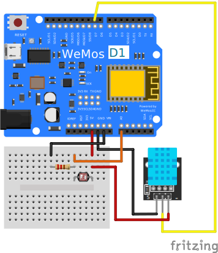
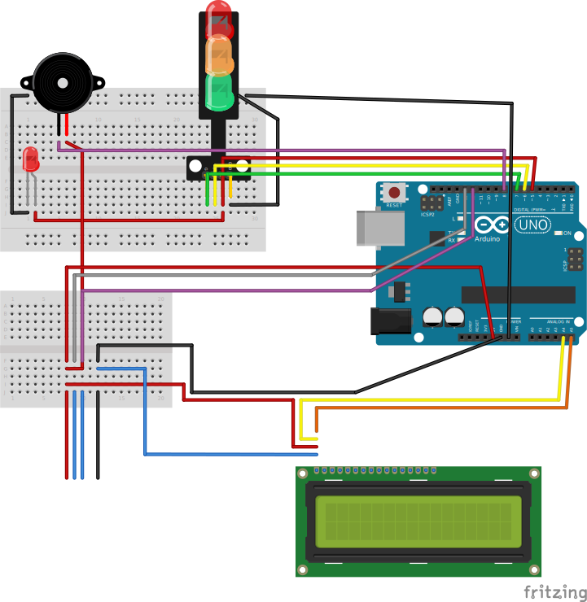
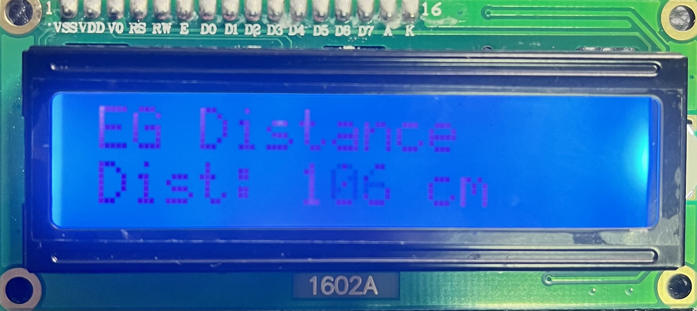

# Elder-Guardian
Developed by Cyan with ❤️  

[](https://github.com/hoony6134/Elder-Guardian) <a href='https://github.com/shivamkapasia0' target="_blank"></a> [](/CONTRIBUTING.md "Go to contributions doc") <br>
<a href='https://github.com/shivamkapasia0' target="_blank"></a> <a href='https://github.com/shivamkapasia0' target="_blank"></a> <a href='https://github.com/shivamkapasia0' target="_blank"></a>
## What is "Elder-Guardian"?
Elder Guardian is a project to protect elders from strangers' approaching and unexpected falling. This is based on two Arduino boards called "Server Side" and "Sensor Side". We use 1 Arduino UNO board and 1 WeMos R1 D1 Board for Wi-Fi Server.
## Server Side
### What is "Server Side"?
Server Side is a board based on WeMos R1 D1 board that is connected to DHT11 (Moisture and Temperature Sensor), light sensor and built-in Wi-Fi Module. This board is connected to the Internet and sends data to client who is connected to the server. The default local IP address would be displayed on serial monitor once connected to laptop. Or, you can use nmap or other network scanner to find the IP address of the host.
### How to make and use "Server Side"?
1. Prepare following parts:
    - WeMos R1 D1 Board
    - DHT11 Sensor
    - Resistor (Brown - Black - Red - Gold)
    - Jumper Wires (Appx. 3 M-F, 3 M-M)
    - Breadboard (Small - 15 holes * 2 or Tiny Breadboard)
    - Light Sensor
    - USB A - Micro 5Pin Data/Power Cable
    - Laptop or Desktop Computer with Arduino IDE installed
2. Make a circuit like this:  

3. Connect the board to the computer with USB cable.
4. Download the code from [here](server.ino) and open it with Arduino IDE.
5. Replace the SSID and Password with your Wi-Fi's SSID and Password (in line 11 and 12)
```cpp
char *ssid = "SSID"; // SSID
char *password = "PW"; // Password ("" for open network)
```
6. Upload the code to the board using Arduino IDE.
7. Open Serial Monitor and wait for the board to connect to the Wi-Fi.
8. Once connected, the local IP address would be displayed on the Serial Monitor.
9. Now, you can use the IP address to connect to the board. After that, computer is not needed anymore.<br>
**Note:** The code is designed to run automatically once the board is powered on, and designed to fit for iPhone 13 Screen. It uses Google Webfont to show the text, so you need to connect to the Internet to use the board. Also, it uses My GitHub-Hosted alert sound, so you need to connect to the Internet to use the alert sound for falling detection.

## Sensor Side
### What is "Sensor Side"?
Sensor Side is a board based on Arduino UNO board that is connected to HY-SRF05(or HC-SR04) Ultra Sonic Sensor, Traffic Light LED, LiquidCrystal 16x2 LCD Panel, Piezo Buzzer, and Extra Red LED (Optional). It's not connected with Server side, but it provides a function to detect approaching of strangers and alert the elders.

### How to make and use "Sensor Side"?
1. Prepare following parts:
    - Arduino UNO Board
    - HY-SRF05(or HC-SR04) Ultra Sonic Sensor
    - Traffic Light LED
    - LiquidCrystal 16x2 LCD Panel with I2C Module
    - Piezo Buzzer
    - Extra Red LED (Optional)
    - Resistor (Optional)
    - Jumper Wires (Appx. 4 M-F, 15 M-M)
    - Breadboard (1 Half Size, and 1 Tiny Size)
    - Arduino UNO - USB A Data/Power Cable
    - Laptop or Desktop Computer with Arduino IDE installed
2. Make a circuit like this:

3. Connect the board to the computer with USB cable.
4. Download the code from [here](sensor.ino) and open it with Arduino IDE.
5. Upload the code to the board using Arduino IDE.
6. Now, you can use the board and enjoy approaching detection and alerting.

## How to use "Server" from "Client"?
1. Connect to the Wi-Fi that the Server is connected to (or use Mobile Hotspot).
2. Open the IP address of the Server that you got from Serial Monitor or nmap from your browser (SmartPhone Screen is recommended - Designed to perfectly fit for iPhone 13, Safari, iOS 17 Dev Beta 2).
3. Now, you can see the data from the Server and use the board.

## How to use "Sensor"?
1. Connect the board to the power source (Power Bank is recommended).
2. Wait for the board to boot up.
3. Attach Ultra Sonic Sensor to the back of your backpack or bag, clothes, or anything that you want to attach.
4. Attach Traffic LED Light and Extra Red LED, LCD to the front of your backpack or bag, clothes, or anything that you want to attach.
5. Enclose the board with a case or something that can protect the board safe and sound.
6. You can see the distance of stranger (or object) from the Ultra Sonic Sensor on the LCD Panel like this:  

7. If the distance is less than 10cm, the board will alert you with the buzzer and the LED, and the LCD Panel will show the small exclamanation mark (!)

## Any Questions?
If you have any questions, please don't hesitate to contact me via [email][def]!  
Or you can open an issue or discussion on this repository.  
Pull requests are also welcome!

[def]: mailto:projects@scian.xyz